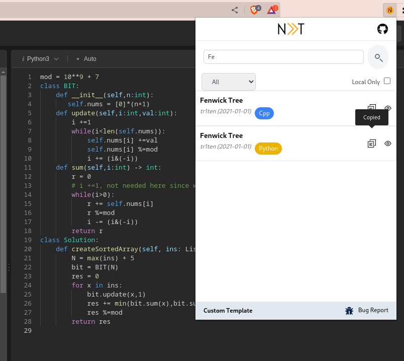

Neet provides ready to use templates for <strong>Data Structures</strong> and <strong>Algorithms.</strong>

 

  
   
  

<h2 align="center">Neet</h2>
 

Neet is an open-source MIT-licensed browser extension that aims provide high-quality coding templates in various programming languages. 

## Features
1. Quick Search & Copy Template
2. Customize Templates
3. Persistent storage
4. Automatically updates the template defination (online)

## Screenshots

## Manual Installation

To install Neet as a browser extension by loading it manually, please follow the steps below:

1. Download the Neet extension zip from the releases page.
2. Unzip the downloaded file to a convenient location on your computer.

3. Open Browser and go to the extensions management page by navigating to `chrome://extensions` or `edge://extensions` or `opera://extensions` or `brave://extensions` or `vivaldi://extensions` in the address bar according to your browser.
4. Enable the "Developer mode" by toggling the switch in the top-right corner of the page.
5. Click on the "Load unpacked" button & Select the unzip file.

Enjoy!
## Build

To build the Neet project, please follow these steps:

1. Open a terminal or command prompt.
2. Navigate to the project directory: `cd neet`
3. Run the build command: `yarn run build`
4. After the build process is complete, all source files will be outputted to the `dist` folder.

## To-Dos
<!-- list of todos -->
- [ ] Add common algorithms and data structures along with tests
- [x] Support user customization of templates
- [ ] Inject templates into web pages

## Contributing
You can contribute to Neet by creating a pull request on GitHub. Please make sure that your pull request adheres to the following guidelines:
1. New Template should be added in the `src/templates` folder with proper test cases.
2. Code should be properly formatted using [Prettier](https://prettier.io/).
## License

Neet is licensed under the [MIT License](LICENSE).
